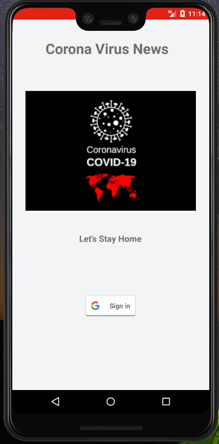
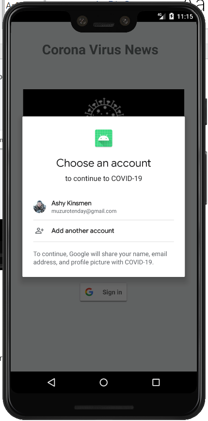
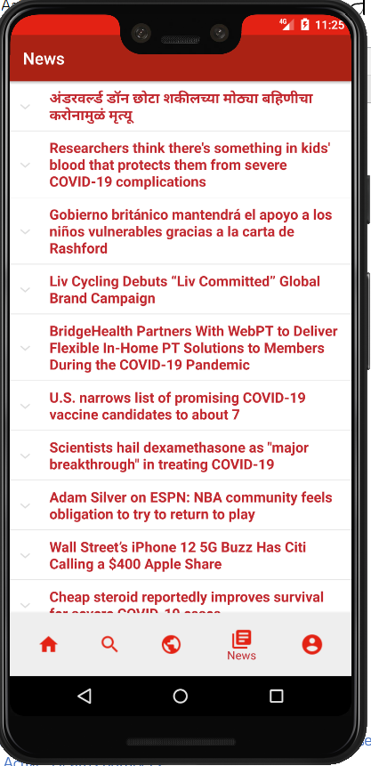
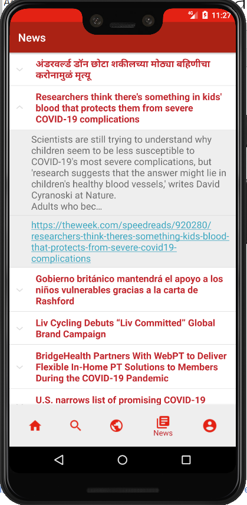
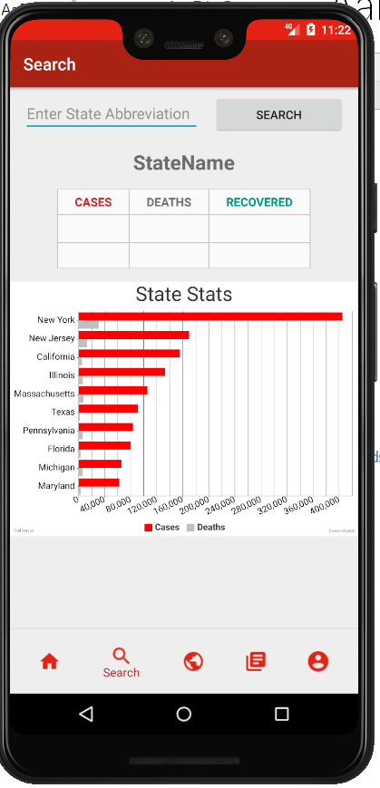
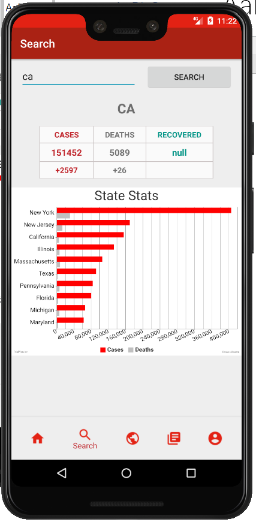
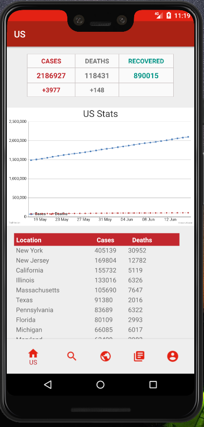
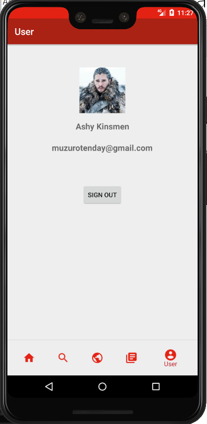
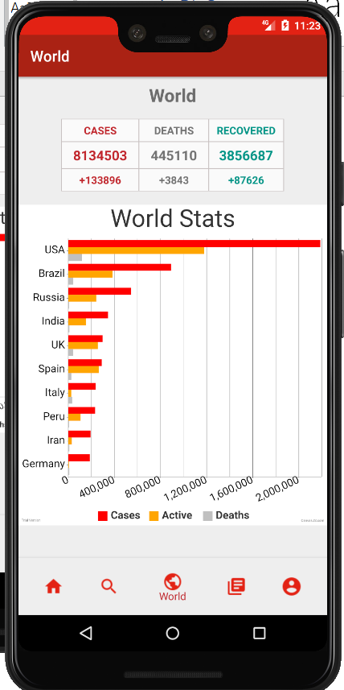

# COVID-19 New Update and Statistics
A school final project(Covid-19 New Updates and Statistics) using Andriod Studio

# Background

Internet and technology has provided us, on numerus occasions, ways and means of handling major life catastrophes. Ranging from the natural disaster alert on Facebook to the algorithm design for helicopters to drop out reliefs and emergency supplies to victims during the Venezuela mudslide 1979. The issue of the nCovid-19 pandemic should not be any different.

Like the aforementioned situations, there is the dying need of using technology, internet and Internet of Things to address rising issues and form a remedy. This project tend to tackle issues general relating to information dissemination/awareness

Nowadays, Coronavirus has become one of the most concerned things for everyone. To help people better understand the situation of the Coronavirus, I created a mobile application that can allow users to see the real-time situation. This application is mainly divided into two interfaces, one is the login interface, and the other is the main interface. Users can see the main interface after logging in with their Google account. The main interface contains five sections. Followed by U.S. statistics, search of state statistics, world statistics, real-time news about Coronavirus and the user information.

# Main design:
(1)	Main functions
    (i)	MainActivity.java
It contains google API and information for User to register into the System once done its grants access to the user into the system function.

    (ii)	HomeActivity.java
Provide the navigation system for the whole application with bottom menu, which is then used for navigating the system from statistics information to news all round the world.
(iii)	WorldFragment.java
Show information of aggregated cases and new cases for that day, it applies for death and recovered people in the world as well. 

    (iv)	USFragment.java
Show information of aggregated cases and new cases for that day, it applies for death and recovered people in the US as well.  

    (v)	UserFragment.java
Show about User and how to log out.

    (vi)	News Fragment
Show news articles from all round the world.
（1）	Optional functions
    (i)	SearchFragment.java
       This is used to show statistics of all states in US. 

# Usage
Download and open with Android Studio

# Screensht of the APP
<h3>Login</h3>

<h3>Main</h3>

# API
1. NovelCOVID API - US: https://corona.lmao.ninja/v2/countries/US
2. NovelCOVID API - State: https://corona.lmao.ninja/v2/states
3. The COVID Tracking Project - Search State: https://covidtracking.com/api/v1/states/FL/daily.json
4. World: https://api.covid19api.com/summary
5. NewsAPI: https://newsapi.org/v2/everything?q=COVID&from=2020-04-27&sortBy=publishedAt&apiKey=&pageSize=20&page=1

# Credit
1. CanvasJS: https://canvasjs.com/javascript-charts/json-data-api-ajax-chart/ (Chart example code)
2. Material Design: https://material.io/resources/icons/?style=baseline (icon)
3. Firebase: https://console.firebase.google.com/u/0/ (Google login)
